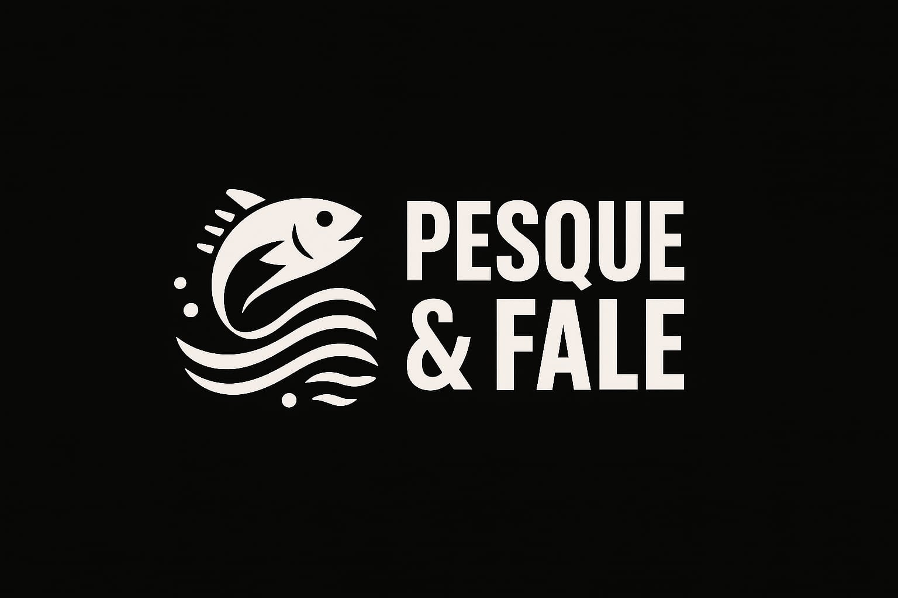
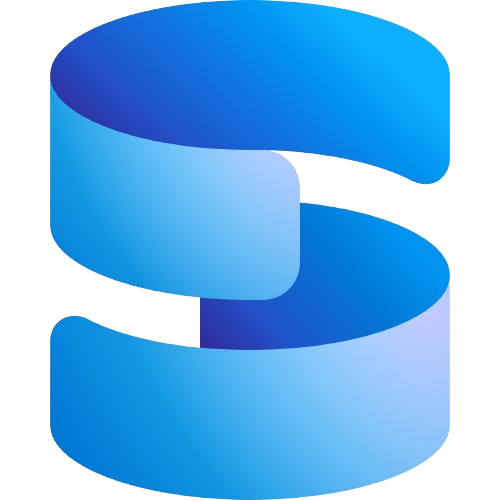

# PESQUE & FALE

[](https://github.com/)
[](LICENSE.md)

---

## Resumo

Aplicação web desenvolvida com **C# / ASP.NET Core (MVC)** que funciona como uma rede social focada em pescadores. Permite cadastro de usuários, compartilhamento de experiências, avaliação de pontos de pesca (rios, lagos, pesque-pagues), publicação de eventos e gestão administrativa. O objetivo é promover práticas de pesca sustentável, facilitar a descoberta de locais agradáveis e impulsionar atividades econômicas locais.

<p align="center">

<p/>


---

## Contexto e Propósito

PESQUE & FALE nasce da necessidade de centralizar informações e experiências sobre pontos de pesca, tornando mais fácil para pescadores (amadores e profissionais) encontrar locais seguros, bem avaliados e sustentáveis. A plataforma atende pescadores individuais, organizações locais e administradores que desejam monitorar ou promover áreas de pesca.

### Audiência principal

* Pescadores recreativos e profissionais
* Gestores de áreas de lazer/ambientais
* Comunidades locais interessadas em pesca sustentável

---

## Funcionalidades Principais

* **Cadastro e autenticação de usuários** (Identity/Cookies)
* **Feed social** com publicações (texto, imagens, localização, avaliações)
* **Criação e avaliação de pontos de pesca** (notas, comentários, fotos)
* **Perfis de pescador** com métricas (posts, seguidores, avaliações)
* **Notificações internas** (novas publicações, eventos)
* **Área administrativa** para gerenciamento de usuários, pontos e publicações
* **Suporte a temas (light / dark)**
* **Eventos de pesca**: criação, listagem e inscrição

---

## Tecnologias

* **Backend:** .NET 8 / C# (ASP.NET Core MVC)

<p align="center">
    
</p>

* **Banco de Dados:** SQL SERVER 

<p align="center">

</p>

* **Frontend:** HTML, CSS, JavaScript

<p align="center">
    
</p>

---

## Arquitetura

Estrutura em camadas: Controllers → Services → Repositories → Data (DbContext). Views (Razor) para páginas públicas e área administrativa. Migrations gerenciadas via EF Core. Recomenda-se usar DTOs/ViewModels e AutoMapper para separar modelos de domínio e modelos de apresentação.

---

## Estrutura de diretórios (exemplo)

```
/src
PesqueFaleCSharp/
├── Controllers/         # Controladores MVC
├── Data/               # Contexto do banco de dados (AppDbContext)
├── Migrations/         # Migrações do Entity Framework
├── Models/             # Modelos de domínio (Pescador, Publicacao, Comentario, Local)
├── Views/              # Views Razor
├── wwwroot/            # Arquivos estáticos (CSS, JS, imagens)
├── Properties/         # Configurações do projeto
```

---

## Instalação e execução (local)

**Pré-requisitos:** .NET 8 SDK, dotnet-ef, SQL Server (ou escolha SQLite para desenvolvimento)

<p align="center">
    
    
</p>


**Comandos nessa ordem**
```bash
# 1. clonar o repositório
git clone https://github.com/seu-usuario/pesque-e-fale.git
cd pesque-e-fale

# 2. restaurar e construir
dotnet restore
dotnet build

# 3. configurar connection string em appsettings.Development.json
# aplicar migrações
dotnet ef database update

# 4. executar
dotnet run --project ./src/PesqueEFALE.Web
```

Acesse: `https://localhost:5001` (ou porta mostrada no output).

---

## Configuração / Variáveis de ambiente

* `ConnectionStrings:DefaultConnection` — string de conexão do banco
* `ASPNETCORE_ENVIRONMENT` — Development | Production

Exemplo (appsettings.json):

```json
"ConnectionStrings": {
  "DefaultConnection": "Server=.;Database=PesqueEFaleDb;Trusted_Connection=True;"
}
```

## Licença

MIT — consulte o arquivo `LICENSE.md`.

---

## **Equipe:**
- [@Dan](https://github.com/daniykt)
- [@Henrique](https://github.com/luisfesantos](https://github.com/HenriqueTavares302))
- [@Lucas](https://www.linkedin.com/in/lucas-catto-a66886372/)
- [@João](https://www.linkedin.com/in/jo%C3%A3o-pedro-ferreira-montrezor-605b72349/)
- [@Vinicius]()
- [@Rebeca](https://www.instagram.com/scutarerebecadeoliveira?igsh=b3BwZmQ3NzB0eDdr)

